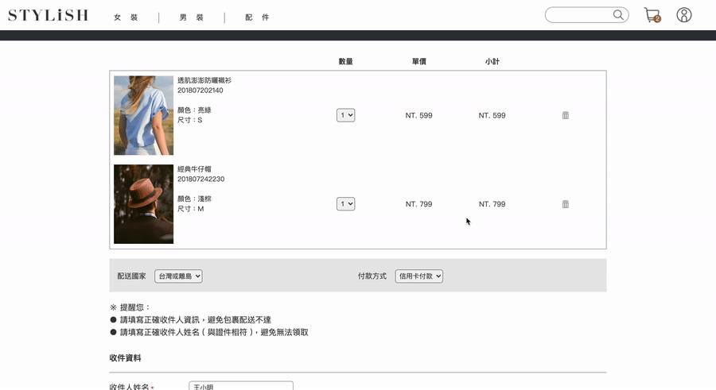

  

  

    An e-commerce RWD website built with plain JavaScript.
     
    <a href="https://vivi2393142.github.io/STYLiSH/"><strong>View Website »</strong></a>
     
  
 

<kbd>
    
</kbd>

<!-- ## Core Components Structure

 -->

## Technologies

-   Front-End Basic
    -   HTML / CSS / JavaScript
    -   RWD
    -   RESTful APIs
    -   AJAX
-   Libraries
    -   Facebook SDK
    -   TapPay
-   Other
    -   Version Control : Git / GitHub

## Website Demo

-   #### Products Explore Page

    -   Sliding Images Effect
    -   Infinite Scroll
    -   Search Product Function

    

    <kbd>
    
    </kbd>
    

-   #### Product Details Page

    -   Corresponding Size & Color Chooses
    -   Add to Cart Function with Local Storage

    

    <kbd>
    
    </kbd>
    

-   #### Shopping Cart Page

    -   Adjust & Remove Item Functions
    -   Regular Expression for Inputs
    -   Checkout Function Integrated with TapPay

    

    <kbd>
    
    </kbd>
    

-   #### Profile Page

    -   Facebook SDK

## Contact

E-mail: vivi2393142@gmail.com
